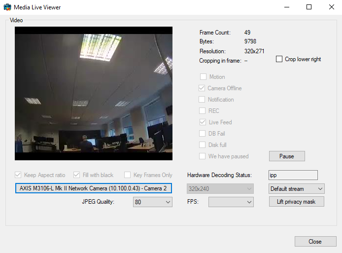

# MediaLiveViewer

The Media Live Viewer shows how to use the media toolkit features
through a C\# application. In this sample it will ask for receiving
frames in JPEG format.

Before the user selects the camera, it is possible to set the following
properties for JPEG live source:

-   Keep Aspect ratio
-   Fill with black
-   Key Frames Only

The user can dynamically control the following properties for the
frames:

-   Resolution
-   JPEG Quality
-   Frame rate
-   Cropping (fixed placement)

The selected properties are being performed on the client side (e.g. the
PC running this application) while still receiving live frames from the
XProtect server in original codec and resolution.

The user can select one of the following stream to be displayed:

-   Default stream
-   Max resolution stream
-   Adaptive stream

The sample demonstrates also how to lift a privacy mask.

While showing the live images as they are coming from the media toolkit,
the frame byte size, resolution and cropping information is displayed in
the top right hand corner.

The disabled check boxes show the information that is received in the
live status messages.

## The sample demonstrates

-   How to effectively retrieve JPEGs from XProtect servers
-   How to interpret live status messages
-   Control of the media toolkit in relation to resolution, quality and
    cropping
-   Handling of renewing login token

## Using

-   VideoOS.Platform.Live.JPEGLiveSource
-   VideoOS.Platform.Live.LiveSourceContent

## Environment

-   .NET library MIP Environment

## Visual Studio C\# project

-   [MediaLiveViewer.csproj](javascript:openLink('..\\\\ComponentSamples\\\\MediaLiveViewer\\\\MediaLiveViewer.csproj');)
