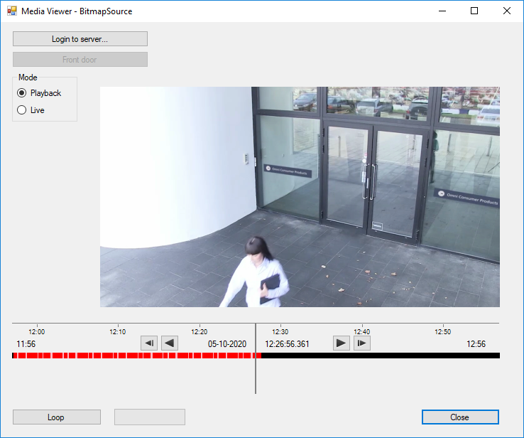

# Media Viewer BitmapSource

The Media Viewer shows how to use the Media toolkit for retrieving live
and stored video.

The first button is used to log in to the XProtect VMS. The next button
is used to pick the camera.

With the radio buttons, you choose whether to browse playback footage or
see live streaming from the camera. Depending on this choice, the
time-line (PlaybackUserControl) will be seen below the camera video
display. This control, similarly to the time-line control of the Smart
Client, allows the user to handle playback.

The loop button illustrates how to implement a looping playback
behavior.

## The sample demonstrates

-   Use of media toolkit BitmapSource
-   Use of PlayBackUserControl to control playback
-   Handling of threads while using media toolkit and UI forms controls

## Using

-   VideoOS.Platform.Client.BitmapSource
-   VideoOS.Platform.Client.PlaybackController
-   VideoOS.Platform.Client.PlaybackUserControl

## Environment

-   .NET library MIP Environment

## Visual Studio C\# project

-   [MediaViewerBitmapSource.csproj](javascript:openLink('..\\\\ComponentSamples\\\\MediaViewerBitmapSource\\\\MediaViewerBitmapSource.csproj');)
