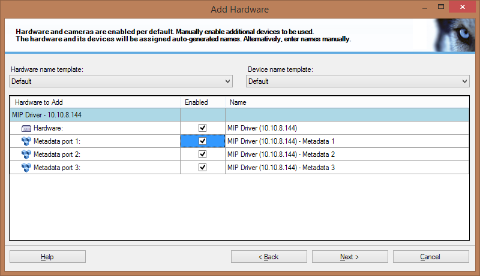
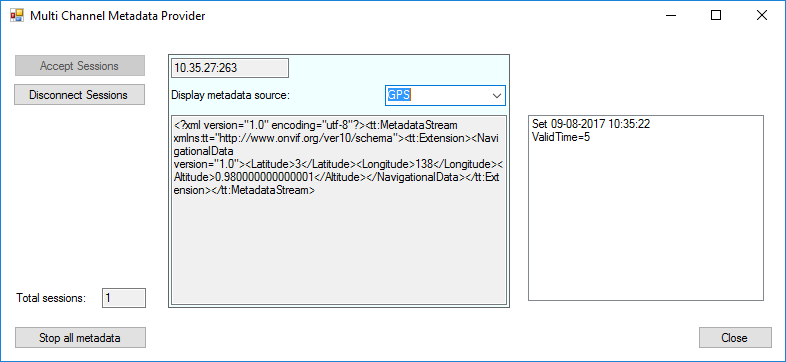

# Multi Channel Metadata Provider

This sample shows how metadata can be injected into an XProtect system
by using multiple channels of different types on the same device.

The sample uses the C\# .Net MIP SDK Library for all communication and
synchronization, while the sample only needs to focus on providing
metadata. The sample supports multiple simultaneous connections, e.g.
metadata can be distributed to two XProtect Recording servers.
Furthermore, this sample demonstrates the push-functionality of
metadata, which is in contrast to the video provider, where data is
polled. Thus it is possible to send metadata at will and even have long
pauses in the data. The sample will create three channels on the same
MediaProviderService instance. There is a bounding box channel, GPS
channel and a channel with a custom type.

The MIP Driver with metadata support is part of the normal Device Packs
from version 7.3.

The sample also shows how to receive notifications about updated
settings on the device (done in the XProtect Management Client). This is
supported from device pack 9.3. Please be aware that the settings will
only be pushed on changes so it is up to the metadata providing device
to store the values received (it cannot be queried on startup).

This is how the \"Add hardware\" dialog looks when adding the metadata
device. All three channels have been found.

The sample app running and displaying the custom metadata.

## How to use this sample

-   Start the sample
-   Click the \"Accept Sessions\" button
-   Start the Management Client
-   Start the add hardware wizard
-   Add username and password to the search list: \"root\", \"password\"
-   Select to use the \"MIP Driver\"
-   Enter IP address of the machine this sample is running on, and port
    52123
-   Press the \"Start all metadata\" button on the sample application.
-   Press \"Stop all metadata\" to stop the stream or Close to exit the
    sample application.
-   You can view the incoming metadata by using the [Metadata Live
    Viewer](../MetadataLiveViewer/README.html) sample

## The sample demonstrates

-   How metadata can be stored in XProtect
-   How to support multiple server channels at one time

## Using

-   VideoOS.Platform.Data.MediaVideoService
-   VideoOS.Platform.Data.MetadataVideoChannel
-   VideoOS.Platform.Data.HardwareDefinition
-   VideoOS.Platform.Data.MetadataStream

## Environment

-   MIP .NET library

## Visual Studio C\# project

-   [MultiChannelMetadataProvider.csproj](javascript:openLink('..\\\\ComponentSamples\\\\MultiChannelMetadataProvider\\\\MultiChannelMetadataProvider.csproj');)
