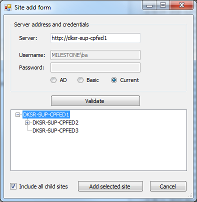
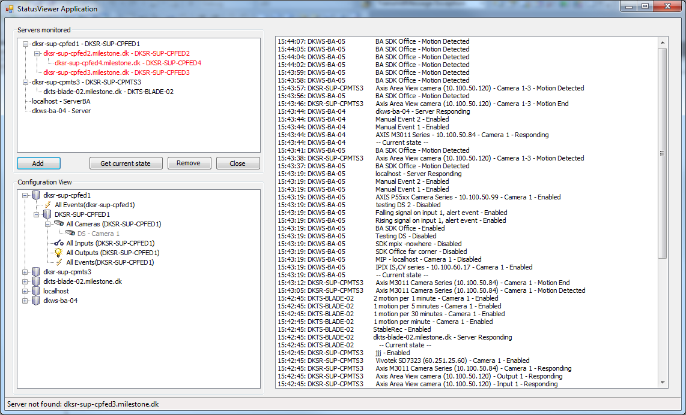

# Multi-Site Status Viewer

This sample shows how to gather status from multiple XProtect systems.
The systems can be of different XProtect models and versions, can use
different logon credentials and belong to different domains. When the
XProtect system is added in this sample you will see the events that are
happening in the system.

When adding an XProtect site you can automatically add the child sites.
There is no limit to how many systems or sites you can add.

To use it click the add button and put in server address, username and
password in the "Site add form dialog".

With many sites added it might look like this:

Remove button is used to remove a site again.

When a site is started the current state of the system is communicated,
this can be repeated using the Get current state button.

## The sample demonstrates

-   How to work with XProtect sites
-   How to subscribe to events from multiple XProtect sites at a time

## Using

-   VideoOS.Platform.Messaging.MessageCommunicationManager
-   VideoOS.Platform.Messaging.CommunicationIdFilter
-   NewEventIndication -- ProvideCurrentStateResponse

## Environment

-   .NET library MIP Environment

## Visual Studio C\# project

-   [MultiSiteStatusViewer.csproj](javascript:openLink('..\\\\ComponentSamples\\\\MultiSiteStatusViewer\\\\MultiSiteStatusViewer.csproj');)
