# Surveillance Cloud

The Surveillance Cloud sample shows how to set up a simple web
application that connects to an XProtect VMS and enables anyone, using a
coupon code, to:

-   Add a Basic user account and a corresponding role with limited
    rights
-   Add delete or replace a limited number of camera devices in their
    account, and give access to live and recorded video to those cameras
    through Smart, Mobile, and Web clients

## The sample demonstrates

-   How to implement a web application that utilizes the MIP SDK
-   How to set up and configure users, roles, and devices, using the
    Configuration API

## Using

-   VideoOS.ConfigurationAPI
-   ASP.NET Web API 2
-   ASP.NET MVC
-   NuGet packages

## Requirements

This solution requires the following:

-   Milestone XProtect Corporate 2016 R1 or higher

-   At least one recording server

-   Visual Studio 17 or higher

## Environment

-   None

## Visual Studio C\# solution

-   [SurveillanceCloudSample.sln](javascript:openLink('..\\\\ComponentSamples\\\\SurveillanceCloud\\\\SurveillanceCloudSample.sln');)

## SurveillanceCloudSample solution

The SurveillanceCloudSample solution has three projects:

-   SurveillanceCloudSample (ASP.NET MVC web application)

-   SurveillanceCloudSampleService (ASP.NET Web API 2 web application)

-   SurveillanceCloudSample.SharedObjects (class library)

## SurveillanceCloudSample

The SurveillanceCloudSample project contains the front-end part of the
solution. There are two views: HomeView (login/register page) and
DashboardView (configuration page). Each view has its own model and
controller.

-   By default, the HomeView view renders the Login form. If a GET
    request contains the parameter `register`, HomeView renders the
    Register form.

    The Register form requires the user to fill in a username, a
    password, and a valid coupon code. Clicking the Register button
    passes the parameters in a POST request, which calls the Register
    method from HomeController. This method calls the
    SurveillanceCloudSampleService and handles the result. If a new user
    account was successfully created, a corresponding record is created
    in a local JSON data store.

    The Login form requires the user to fill in a username and a
    password. Clicking the Login button passes the parameters in a POST
    request, which calls the Login method from HomeController. This
    method calls the SurveillanceCloudSampleService and handles the
    response. If the login is successful, the method sets the returned
    user ID into the session values for later use.

-   After successful login, the DashboardView is called. Before
    rendering the Configuration Panel form, DashboardController calls
    SurveillanceCloudSampleService to get the user's data. DashboardView
    renders the Configuration Panel form depending on how many cameras
    the user is allotted.

    To create a camera device, the user fills in a device IP address,
    username, password, and optionally a device name. When the Save
    button for a device is clicked, the AddDevice method from
    DashboardController is called, passing the form values as POST
    parameters. This method calls the SurveillanceCloudSampleService and
    handles the response.

## SurveillanceCloudSampleService

The SurveillanceCloudSampleService project is the service that
communicates with the Milestone Configuration API.

It uses the Web API 2 Framework. It has only one controller,
ValuesController, which is the default controller. The constructor of
the ValuesController reads the settings needed for connection to the VMS
from the `Web.config` file and then connects to the VMS. The
ValuesController has four methods which can be called by POST request.
The methods are: Register, Login, GetUserCameras and AddDevice.

It also has a private dictionary `codes`, which has all the acceptable
coupon codes hardcoded for registration. The number of camera devices
allotted to the newly created user depends on the code passed to the
Register method. The dictionary looks like this:

~~~ cs
private Dictionary<string, int> codes = new Dictionary<string, int> { { "1cam", 1 }, { "2cams", 2 }, { "3cams", 3 }, { "4cams", 4 } };
~~~

Here, if the `1cam` code is entered, the user will be able to add 1
device, if the `2cams` code is entered, the user will be able to add 2
devices, and so forth.

For each new user, a corresponding role is created. This role is
assigned limited rights (live view and playback) to camera devices that
the user adds.

Cameras are added using auto-detection of the camera model; thus, adding
a camera may take a while. The device is added with default properties,
except for the optional name.

If no camera groups exists, a new camera group named SurveillanceCloud
will be created for the first camera added. Else, cameras will be added
to the first camera group created.

## Running the sample using Visual Studio

1.  To run the sample, you must first configure the connection to the
    VMS. To do that, open the `Web.config` file located at
    `SurveillanceCloudSampleService\Web.config` and find the
    `VMSSettings` configuration group. It looks like this:

    ~~~ xml
    <VMSSettings>
        <Address>
          <add key="Ip" value="localhost"/>
          <add key="Port" value="80"/>
        </Address>
        <Credentials>
          <add key="Username" value="SurveillanceCloud"/>
          <add key="Password" value="\{R(5[8Hm3+t"/>
          <add key="Authtype" value="Basic"/>
          <!--
            <add key="Authtype" value="Digest"/>
            <add key="Domain" value="."/ 
          -->
        </Credentials>
      </VMSSettings>
    ~~~

    Replace the **Ip**, **Port**, **Username**, and **Password** fields
    as needed.

    Select **Authtype** \"Digest\" to use Windows authentication. Set
    **Domain** only for **Authtype** \"Digest\".

    The **Username** must exist in the VMS and must have access rights
    for:

    -   Connect to Management Server: Management Server \| Connect

    -   Creating roles and basic users: Management Server \| Read, Edit,
        Manage security

    -   Assigning users to a role: Management Server \| Manage security

    -   Adding hardware to a Recording Server: Recording Servers \|
        Manage hardware; Hardware \| Edit

    -   Adding cameras to a camera group: Cameras \| Read, Edit

2.  Open the `SurveillanceCloudSample.sln` solution file with Visual
    Studio.

3.  Set the `SurveillanceCloudSample` and
    `SurveillanceCloudSampleService` projects as startup projects. To do
    this, in the **Solution Explorer** window, right click on the
    Solution and select **Set StartUp Projects**.

    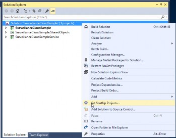

4.  Select the **Multiple startup projects** option and set the
    **Action** of `SurveillanceCloudSample` and
    `SurveillanceCloudSampleService` projects to **Start**.

    Then click **OK**.

    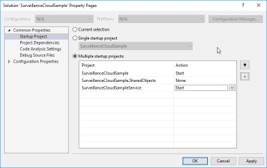

5.  Right-click **SurveillanceCloudSampleService** and select
    **Properties**.

6.  In the **SurveillanceCloudSampleService** window, select **Web**. On
    this page, under **Start Action**, select **Don\'t open a page. Wait
    for a request from an external application**.

7.  Save.

8.  Run the sample using the **Run** button or by pressing F5.

The Login page opens in the web browser.

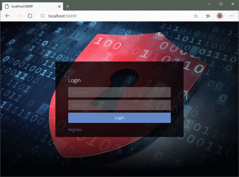

Click the Register button to display the Register form.

See [Registering a new user](#registering_a_new_user) for help on how to
proceed.

## Running the sample using IIS

1.  To run the sample without using Visual Studio, you need to enable
    IIS. Open `%windir%\System32\OptionalFeatures.exe`.

2.  Select **Internet Information Services** \> **Web Management
    Tools** \> **IIS Management Console** and **World Wide Web
    Services** and click **OK**. Wait for the features to be enabled.

    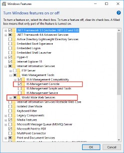

3.  Open **Internet Information Services (IIS) Manager**
    (`%windir%\system32\inetsrv\InetMgr.exe`).

4.  Right click on **Sites** and select **Add Website...**

    

5.  In the **Add Website** window, do the following:

    1.  In the **Site name** field, enter ***SurveillanceCloudSample***

    2.  In the **Port** field, enter ***81***

    3.  In the **Physical path** field, enter the path to your
        SurveillanceCloudSample folder

    4.  Click **OK**

        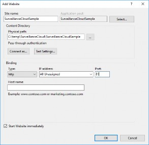

6.  In **Application Pools**, select **SurveillanceCloudSample** and
    click **Advanced Settings**.

    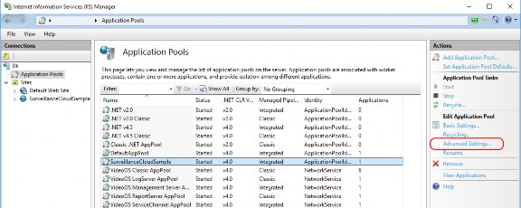

7.  In the **Advanced Settings** window, open the **Identity** browser

    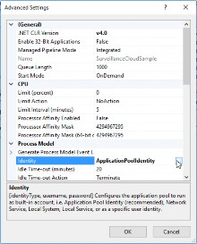

    and select **Network Service** and click **OK**.

    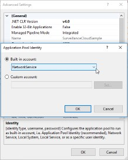

8.  In the **Internet Information Services (IIS) Manager**, right click
    on **Sites** and select **Add Website...**

    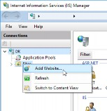

9.  In the **Add Website** window, do the following:

    1.  In the **Site name** field, enter
        `SurveillanceCloudSampleService`

    2.  In the **Port** field, enter `8083`

    3.  In the **Physical path** field, enter the path to your
        `SurveillanceCloudSampleService` folder

    4.  Under the **Application pool** field, click **Select** and
        select **SurveillanceCloudSample** as the application pool

    5.  Click **OK**.

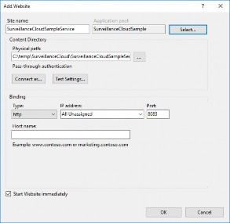

Open `http://localhost:81` in your web browser.

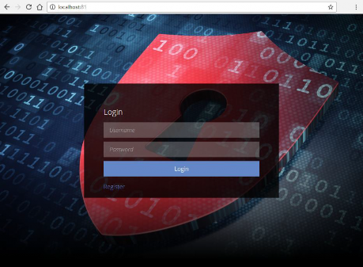

Click the Register button to display the Register form.

See [Registering a new user](#registering_a_new_user) for help on how to
proceed.

## Registering a new user

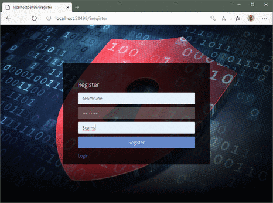

The username must be new: You cannot register an existing user.

The password must meet the complexity requirements for the Windows
operating system on the computer with the Management Server service
installed.

The code must be one of the keys in the `codes` dictionary:

-   1cam
-   2cams
-   3cams
-   4cams

## Adding a camera

After logging in, you can add and manage the number of cameras allowed
by the coupon code.

The camera you add must be new; you cannot add an existing camera.

Enter IP address, username, and password of the new camera in an empty
camera slot. The camera name is optional and can be changed after the
camera has been added. Click the Save button.

Cameras are added using auto-detection of the camera model; thus, adding
a camera may take a while.

## Deleting or replacing a camera

To delete a camera, clear the IP address field and click the Save
button.

To replace a camera, enter IP address, username, and password of the new
camera in an already used camera slot. The camera name is optional and
can be changed after the camera has been added. Click the Save button.

