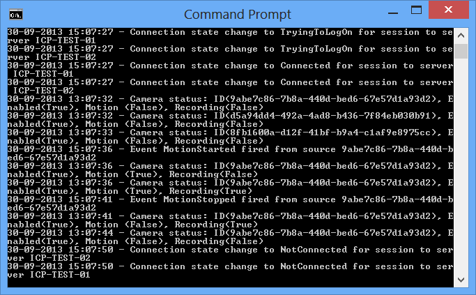

# System Status Client Console

This sample shows how to access the Status API on all Recording Servers
using the SystemStatusClient class.

This client will connect to the Management Server, get the configuration
and find all Recording Servers in the system. The SystemStatusClient
will make sure to start and stop connections when needed, e.g. in case
of failover or lost connections. It will also remove duplicates of
events sent from all servers.

The sample is a console application to make the code as simple as
possible, while still demonstrating the key access methods.

The application takes the name of the Management Server as an argument
on the command line as well as the username and password used to log on
to the system. It will then set up the environment and initialize a
SystemStatusClient instance. Event handler are then assigned after which
connections are started to the recording servers. When the connections
are established, the subscriptions are set on the client and events will
start coming from the Recording Servers. Below is a screenshot of the
SystemStatusClient connected to an XProtect system with two Recording
Servers.

The application will dump any state changes and events that occur while
the application is running.

## The sample demonstrates

-   How to access the status API on all Recording Servers in a system
    using the SystemStatusClient class
-   How to use the client to get status information on all cameras in
    the system
-   How to subscribe to specific events across all Recording Servers
-   How to use the MultuEnvironment to log in

## Using

-   VideoOS.Platform.SDK.StatusClient.StatusSession
-   VideoOS.Platform.SDK.StatusClient.SystemStatusClient
-   Event arguments in the
    VideoOS.Platform.SDK.StatusClient.StatusEventArgs namespace

## Environment

-   None

## Visual Studio C\# project

-   [SystemStatusClientConsole.csproj](javascript:openLink('..\\\\ComponentSamples\\\\SystemStatusClientConsole\\\\SystemStatusClientConsole.csproj');)
